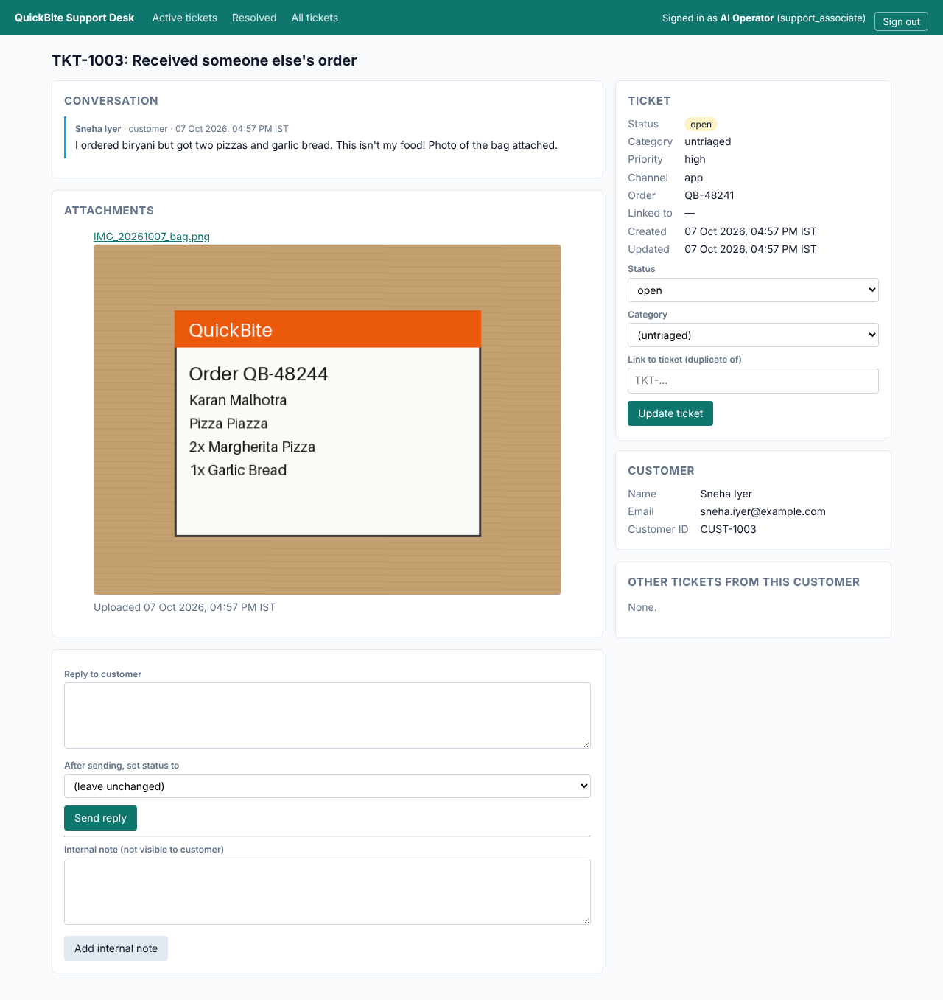
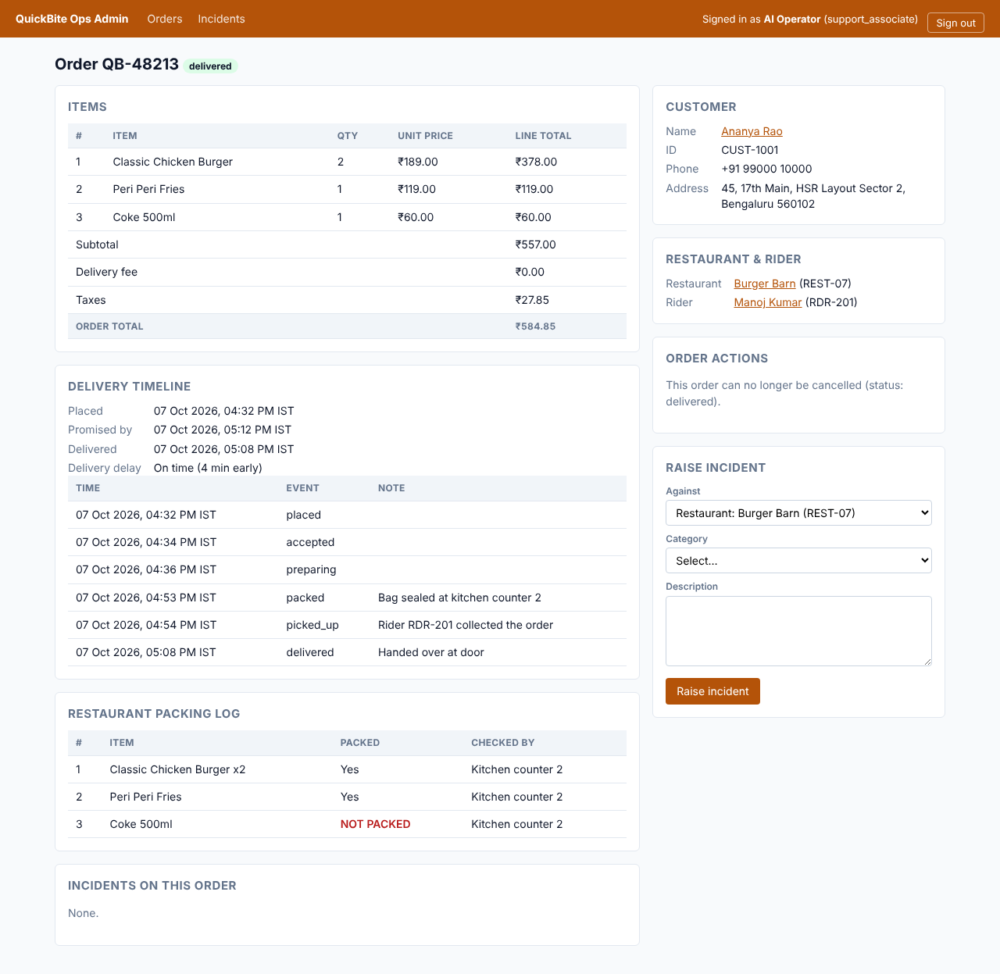

# Autonomous Company Operator

An AI employee that turns a company request into **completed, verified work**.

It plays a Customer Support Operations Associate at **QuickBite**, a fictional
food-delivery company modelled on platforms like Swiggy and Zomato. Given a
ticket such as *"My Coke wasn't in the bag"*, it works out what needs doing from
the company's own procedures and policies. It then operates QuickBite's
back-office web apps in a real browser, asks a human when policy requires it,
checks independently that the outcome really happened, and returns evidence.

> Built against the CentrAlign AI Founding Engineer problem statement.
> See [`docs/BLUEPRINT.md`](docs/BLUEPRINT.md) for the full design.

**Status:** step 9 of 13 (task queue, background workers and supervisor requests). See the
[build plan](docs/BLUEPRINT.md#6-build-plan).

---

## The core loop

```
Goal → Understand → Plan → Execute → Observe → Adapt → Verify → Complete
```

## Repository layout

| Path | What lives there |
|---|---|
| `company_operator/` | The AI employee: runtime, planning, verification, tools, memory, policy, LLM client, queue, audit log, API, Company Pack loader |
| `sandbox/quickbite/` | QuickBite's sandboxed systems: Support Desk, Ops Admin, Payments Console |
| `company_packs/quickbite/` | QuickBite's SOPs, policies, systems and permissions, stored as data ([details](company_packs/quickbite/README.md)) |
| `dashboard/` | React + TypeScript dashboard |
| `evals/` | Scenario harness and reliability scorecard |
| `tests/` | Test suite |
| `docs/` | Blueprint, architecture and design decisions |

## Setup

Requirements: Python 3.12+, [uv](https://docs.astral.sh/uv/), Node.js 22+. `make install` downloads
Playwright's Chromium; to use an existing Chromium instead, set `ACO_BROWSER_EXECUTABLE`.

```bash
cp .env.example .env
make install      # Python deps, Chromium for Playwright, dashboard deps
```

## Language model

The operator's thinking phases (understand, plan, next action, summary) use a
language model through a provider-neutral interface:

| Provider | Setting | Notes |
|---|---|---|
| Google Gemini | `ACO_LLM_PROVIDER=gemini` | Free key at [aistudio.google.com](https://aistudio.google.com) |
| OpenAI-compatible | `ACO_LLM_PROVIDER=openai_compatible` + `ACO_LLM_BASE_URL` | Groq, OpenRouter, Ollama, OpenAI, vLLM… |

`ACO_LLM_MODELS` is an ordered list:

- If a model is overloaded, it is retried with backoff, and then the next
  model takes over.
- If a model reports that it is out of quota, it is skipped for the time the
  provider asks for.
- Every model call is recorded in the run's audit log, with model, tokens and
  latency.

Free tiers have small daily request limits, so one form (several fields, then
submit) is completed in a single model turn.

## Run

Resolve one ticket end to end, with a fresh sandbox, and watch it work:

```bash
make run TICKET=TKT-1001        # = uv run operator-run --ticket TKT-1001 --sandbox
uv run operator-run --text "Process today's late-delivery tickets" --sandbox --headed
```

Every run gets its own folder, `data/runs/<run_id>/`, containing:

| File | Contents |
|---|---|
| `state.json` | The checkpoint, which lets a paused run resume |
| `events.jsonl` | The full audit log |
| `evidence/` | Screenshots and attachments |
| `report.md` / `report.json` | What was asked, what was done, and each success criterion with the evidence that proves it |

A run only completes when an **independent verifier** has confirmed the
outcome:

- It re-reads the systems of record in a separate session that cannot change
  anything.
- A model that never saw the operator's reasoning judges each criterion
  against those pages.
- Integrity checks in code run alongside, e.g. that the same money movement
  never happened twice.

### Working through a queue

The operator is meant to work like an employee with a queue, not one command
at a time.

```bash
make sandbox                                                   # terminal 1
make worker                                                    # terminal 2 (= operator-worker; --workers 2 for parallel tasks)
uv run operator-run --enqueue --ticket TKT-1001                # terminal 3: add work
uv run operator-run --enqueue --text "Clear all open late-delivery tickets" --priority high
```

How the queue behaves:

- Tasks are durable and run in priority order, and a ticket is never queued
  twice while it is still active.
- A worker holds a lease on its task. If the worker dies, another reclaims
  the task and continues it **from its checkpoint**.
- Paused runs go back to the queue as `waiting` and are re-checked
  automatically. Approvals, answers, customer replies and finished sub-tasks
  are picked up without anyone typing `--resume`.
- A supervisor request covering many tickets is split by the operator itself
  (`delegate_tasks`) into one sub-task per ticket. Each sub-task is resolved
  and verified on its own, and the parent resumes with their outcomes. If a
  sub-task escalates, its ticket is handed to a person: the runtime refuses
  any change the parent tries to make to it, and the parent reports it as
  needing a person instead.

The API (`make api`) also serves:

- `POST /tasks`, `GET /tasks`, `GET /tasks/{id}` and `POST /tasks/{id}/cancel`
- `GET /runs/{id}`, `/report`, `/events` and `/evidence/{file}`
- `GET /runs/{id}/stream`: a live Server-Sent Events stream of the run
- `GET /stats`

### When the operator needs a person

The operator pauses when:

- **policy requires approval**, e.g. a refund above ₹500, a full-order refund
  or a repeat claimant;
- **it needs a supervisor's answer** to a question;
- **it is waiting for a customer** to reply on their ticket.

Requests are stored in `data/operator.db`, so a run can wait for hours, and
can be resumed by another process.

```bash
uv run operator-run --inbox                                  # what is waiting for a person
uv run operator-run --approve H-1001
uv run operator-run --reject H-1001 --note "No refunds for repeat claimants without photo proof" --remember
uv run operator-run --resume <run_id> --watch 300            # continue; keep checking for up to 5 minutes
```

`--remember` turns the note into a **learned company fact**. Every future run
sees it next to the Company Pack's own facts. Finished runs are also kept as
**episodes**, so a similar request later can see how earlier ones were
handled.

The same inbox is served by the API (`make api`):

- `GET /requests`
- `POST /requests/{id}/decision`
- `GET`, `POST` and `DELETE /memory/facts`
- `GET /memory/episodes`

When a run has to stop, it first **hands over**. It puts the ticket on hold
with an internal note saying why it stopped, what it checked and what it
changed, so a person can pick it up.

Other commands:

```bash
make sandbox      # QuickBite's back-office apps on http://127.0.0.1:8100
make api          # operator API on http://127.0.0.1:8000
make dashboard    # dashboard on http://localhost:5173
```

The sandbox's systems, logins, scenario catalogue and fault injection are
documented in [`sandbox/quickbite/README.md`](sandbox/quickbite/README.md).

| Support Desk | Ops Admin |
|---|---|
|  |  |

## Develop

```bash
make check            # lint + typecheck + tests (what CI runs)
make format           # auto-format Python
make dashboard-build  # type-check and build the dashboard
```

## Documentation (filled in as the build progresses)

- Architecture: [`docs/BLUEPRINT.md`](docs/BLUEPRINT.md#3-architecture)
- Design decisions: [`docs/BLUEPRINT.md`](docs/BLUEPRINT.md#32-key-design-decisions-the-why-for-the-interview)
- Known limitations: [`docs/BLUEPRINT.md`](docs/BLUEPRINT.md#7-known-limitations-stated-honestly)
- Models, APIs and frameworks used: *to be completed*
- Assumptions: *to be completed*
- Demo: *to be completed*
